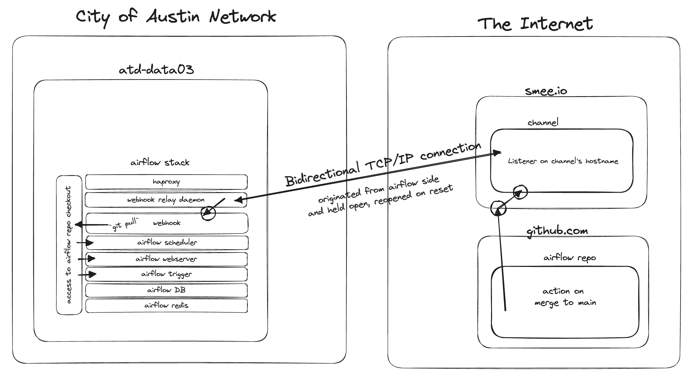

# DTS Airflow stack

This stack is used to run DTS ETL processes and the production instance is deployed on `atd-data03`. Local development is available, and instructions are below.

The stack is composed of:

- Airflow v2 ([Docker image](https://hub.docker.com/r/apache/airflow))
- [HAProxy](https://www.haproxy.org/) to distribute HTTP requests over the stack
- [Flower](https://airflow.apache.org/docs/apache-airflow/stable/administration-and-deployment/security/flower.html) workers dashboard to monitor remote workers
- Webhook to trigger git pulls using the [smee.io client](https://github.com/probot/smee-client)

## Getting Started

### Local Setup

To get started, create a `.env` file with the following variables:

```
AIRFLOW_UID=0
ENVIRONMENT=development
_AIRFLOW_WWW_USER_USERNAME=admin
_AIRFLOW_WWW_USER_PASSWORD=<Pick your initial admin password here>
AIRFLOW_PROJ_DIR=<The absolute path of your Airflow repository checkout>
OP_API_TOKEN=<Get from 1Password entry named "Connect Server: Production Access Token: API Accessible Secrets">
OP_CONNECT=<Get from 1Password entry named "Endpoint for 1Password Connect Server API">
OP_VAULT_ID=<Get from 1Password entry named "Vault ID of API Accessible Secrets vault">
```

Then, to build and start the stack:

```bash
$ docker compose build
$ docker compose up -d
```

Now,

- Airflow is available at http://localhost:8080
  - You can log in to the dashboard using the username and password set in your `.env` file
- The webhook flask app is available at http://localhost:8081
- The workers' status page available at http://localhost:8082 
- The test weather DAG output is available at http://localhost:8083

### Developing a DAG

Example command to execute a DAG in development. This is the CLI version of triggering the DAG manually in the web UI.
```
docker compose run --rm airflow-cli dags test weather-checker
```

### Updating the stack

These instructions were created while updating a local Airflow stack from 2.5.3 to 2.6.1. Updates which
span larger intervals of versions or time should be given extra care in testing and in terms of reviewing
change logs.

The same process can be used when updating the stack with changes that originate from our team. These might include:
  * Adding new requirements to the `requirements.txt` for the local stack
  * Modifying the `Dockerfile`
  * Modifying the webhook or webhook proxy system
  * Modifying the haproxy configuration

#### Update Process

- Read the "Significant Changes" sections of the Airflow release notes between the versions in question: https://github.com/apache/airflow/releases/
  - Apache Airflow is a very active project, and these release notes are pretty dense. Keeping a regular update cadence will be helpful to keep up the task of updating airflow from becoming an "information overload" job.
- Snap a backup of the Airflow postgreSQL database
  - You shouldn't need it, but it can't hurt.
  - The following command requires that the stack being updated is running.
  - The string `postgres` in the following command is denoting the `docker compose` service name and not the `postgres` system database which is present on all postgres database servers. The target database is set via the environment variable `PGDATABASE`.
  - `docker compose exec -t -e PGUSER=airflow -e PGPASSWORD=airflow -e PGDATABASE=airflow postgres pg_dump > DB_backup.sql`
- Stop the Airflow stack
  - `docker compose stop`
- Compare the `docker-compose.yaml` file in a way that is easily sharable with the team if needed
  - Start a new, blank gist at https://gist.github.com/
  - Copy the source code of the older version, for example: https://raw.githubusercontent.com/apache/airflow/2.5.3/docs/apache-airflow/howto/docker-compose/docker-compose.yaml
  - Paste that into your gist and save it. Make it public if you want to demonstrate the diff to anyone.
  - Copy the source code of the newer, target version and replace the contents of the file in your gist. An example URL would be: https://raw.githubusercontent.com/apache/airflow/2.6.1/docs/apache-airflow/howto/docker-compose/docker-compose.yaml.
  - Look at the revisions of this gist and find the most recent one. This diff represents the changes from the older to the newer versions of the upstream `docker-compose.yaml` file. For example (2.5.3 to 2.6.1): https://gist.github.com/frankhereford/c844d0674e9ad13ece8e2354c657854e/revisions.
  - Consider each change, and generally, you'll want to apply these changes to the `docker-compose.yaml` file.
- Update the `FROM` line in the `Dockerfile` found in the top of the repo to the target version.
- Update the version shown in the status message in the webhook's GET route
  - https://github.com/cityofaustin/atd-airflow/blob/airflow-v2/webhook/webhook.py#L34
- Update the comments in the docker-compose file that reference the version number. (2X)
- Build the core docker images
  - `docker compose build`
- Build the `airflow-cli` image, which the Airflow team keeps in its own profile
  - `docker compose build airflow-cli`
- Restart the Airflow stack
  - `docker compose up -d`

### Minimal Testing

The following process indicates that the following systems are working:

- Airflow DAG recognition
- Airflow DAG scheduling
- Airflow DAG execution
- 1Password integration
- Docker services available to DAGs

#### Testing Steps

- With the updated stack running, check the version in the footer. It should reflect the intended target version.
- Trigger or wait for an execution of the diagnostic ETL (Weather).
  - Check that Airflow can successfully execute the DAG and that it produces the correct records in the web UI.
- Check the output of the diagnostic ETL.
  - The output of this DAG should include:
    - A printout of a written weather prediction from NOAA
    - An appropriate execution time which is less than 5 minutes from the present.
    - A printout of the 1Password Entry `Diagnostic ETL (Weather)` demonstration secret, appropriate for the environment type you're testing.
    - An image with:
      - An updated timestamp less than 10 minutes old at most
      - A street camera and signal icon in the upper left
      - Annotation in the upper center

## CI/CD

The Airflow stack addresses CI via the combination of three systems: A GitHub action, a webhook and a proxy system for the webhook call. The chain of events are depicted here.



### GitHub Workflow

Found [here](https://github.com/cityofaustin/atd-airflow/tree/master/.github/workflows/production_deployment.yml), this workflow fires off whenever a pull request is merged into the `production` branch. This particular, specific event is targeted through both the `on:` functionality of workflows, but also through the `if:` logic found at the top of the `deployment:` directive.

The workflow uses a handful of secrets found in the repository's secrets section. These secrets concern access to the 1Password connect server, and are used to get the current value of the Airflow stack's webhook access token and the current URL where we want to invoke our webhook.

Finally, the workflow issues the webhook, which is really nothing more than an empty POST to a certain address. It's the event that matters to us, not any data in the post, with the one exception of a `X-Webhook-Key` header which contains the access key retrieved from 1Password.

### Airflow Webhook

The Airflow stack contains a webhook, provided by a flask app running in a docker container named `webhook`. It listens for `GET` requests, which it will respond with a status message and for `POST` requests, where it will verify the `X-Webhook-Key` header, and if it's a match, issue a `git pull` on the checkout, causing our DAGs to be updated from `production` as found in GitHub. Airflow will immediately pick up on the changed DAG files and begin to operate under the their directives.

### Airflow Webhook Proxy system via [smee.io](https://smee.io/)

The Airflow stack operates on an on-premises machine behind the COA edge router, and therefore it has no method for listening on a publicly routable IP address. Because of this, a webhook proxy system is used which is provided by smee.io. Smee.io offers up unique hostnames, called a "channel", on which it will listen for a webhook POST event. Upon receipt, it will relay the post's contents to any smee.io daemons which have subscribed to that particular smee.io channel.  The smee.io daemon, upon receiving notice that a webhook was received at the public hostname, will issue its own POST request to the Airflow webhook bearing the same headers that were passed down through the smee.io daemon. In this manner, the post event is relayed from the public internet down into the stack residing on the COA internal IPs.

## Utilities

### 1Password utility

The 1Password utility is a light wrapper of the [1Password Connect Python SDK](https://github.com/1Password/connect-sdk-python) methods. The purpose of the utility is to reduce imports of the 1Password library, its methods, and vault ID in each DAG that requires secrets.

### Slack operator utility

The Slack operator utility makes use of the integration between the Airflow and a Slack app webhook. The purpose of the utility is to add Slack notifications to DAGs using the [callback](https://airflow.apache.org/docs/apache-airflow/stable/administration-and-deployment/logging-monitoring/callbacks.html#callback-types) parameters. Failure, critical failure, and success notifications are implemented.

## Useful Commands

- 🐚 get a shell on a worker, for example

```
docker exec -it airflow-airflow-worker-1 bash
```

- ⛔ Stop all containers and execute this to reset your local database.
  - Do not run in production unless you feel really great about your backups.
  - This will reset the history of your dag runs and switch states.

```
docker compose down --volumes --remove-orphans
```

## Ideas

- Make it disable all DAGs on start locally so it fails to safe
- Create remote worker image example
  - Use `docker compose` new `profile` support
- 🤔 Extend webhook to rotate key in 1Password after every use
  - a true rolling token, 1 use per value
